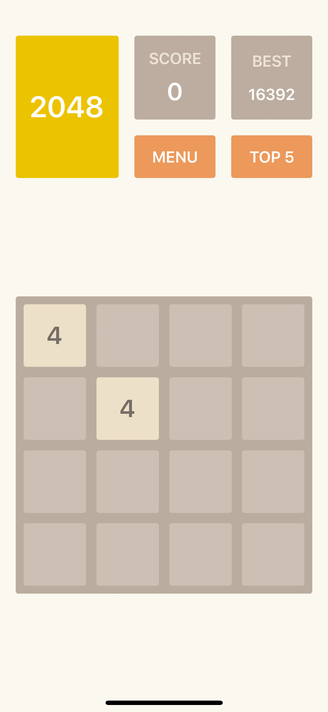
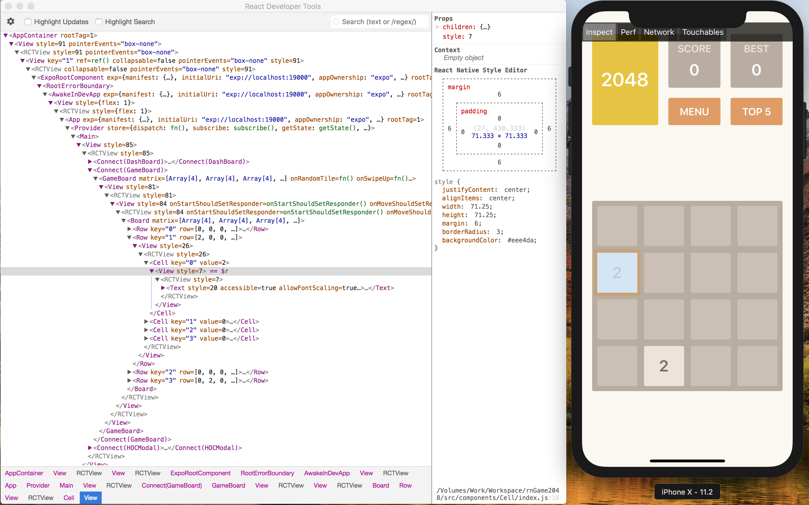

# rnGame2048

[](https://nodejs.org)

基于 JavaScript 的开源框架 [React Native](https://facebook.github.io/react-native/docs/getting-started.html) 可以用于开发 iOS/Android 原生应用，[redux](https://github.com/reactjs/redux) 是 react 社区最热门的应用状态管理容器。

本项目是基于 [React Native](https://facebook.github.io/react-native/docs/getting-started.html), [redux](https://github.com/reactjs/redux) 构建的 2048 游戏应用。


## 预览



## 技术栈

* [react native](https://facebook.github.io/react-native/docs/getting-started.html): 组件式构建 UI
* [redux](https://github.com/reactjs/redux): 管理应用状态
* [redux saga](https://github.com/reactjs/redux): 管理异步调用
* [babel](https://github.com/babel/babel): 转译 es6+ 语法
* [expo](https://expo.io/): 本地调试 react native 应用

## 结构

* src: 项目源码，主要是 react 组件代码。
  * actions: redux 的相关 action.
  * components: react native 的无状态组件. 每个组件功能最小化，提高复用性。
  * containers: 容器组件，操作 redux 数据
  * reducers:
  * sagas:
  * utils:

## React Native 实践

### 实践

* 数据缓存：通过 `store.subscribe` 订阅 redux 状态更新，把状态序列化到 `AsyncStorage` 储存。打开应用读取缓存数据，更新状态。

* 一个文件一个组件。

* 尽量使用无状态（Stateless）组件，即展示组件。不需要保存自己的状态，不需要生命周期方法或者 `refs` 来操作 `DOM` 的组件优先使用无状态组件，采用函数的形式。以 `Button` 组件为例:

```js
  import React from 'react';
  import PropTypes from 'prop-types';
  import { View, Text, TouchableOpacity } from 'react-native';

  const Button = ({onPress, styles, btnText}) => {
    return (
      <TouchableOpacity style={styles.btnWrapper || {}} onPress={() => onPress()}>
        <View style={styles.controller || {}}>
          <Text style={styles.text || {}}>{btnText}</Text>
        </View>
      </TouchableOpacity>
    );
  };

  Button.propTypes = {
    onPress: PropTypes.func.isRequired,
    styles: PropTypes.object.isRequired,
    btnText: PropTypes.string.isRequired
  };

  Button.defaultProps = {
    onPress: () => {},
    styles: {},
    btnText: ''
  };

  export default Button;
```

* 如果需要组件生命周期方法优化组件性能，需要组件保存自己的状态，或者用 `refs` 操作 `DOM`, 你就需要一个有状态组件，采用 `es6 class` 继承 `React.Component` 的写法。以 `BestScore` 组件示例：

```js
  import React from 'react';
  import PropTypes from 'prop-types';
  import { bindActionCreators } from 'redux';
  import { connect } from 'react-redux';

  import { Score } from '../../components';

  import { bestScoreActions } from '../../actions';

  class BestScore extends React.Component {
    shouldComponentUpdate(nextProps) {
      return nextProps.bestScore !== this.props.bestScore;
    }
    componentWillReceiveProps(nextProps) {
      if (nextProps.score > this.props.bestScore) {
        this.props.onBestScoreUpdate(nextProps.score, this.props.bestScore);
      }
    }
    render() {
      return (
        <Score text={'BEST'} score={this.props.bestScore} />
      );
    }
  }

  BestScore.propTypes = {
    bestScore: PropTypes.number.isRequired,
    score: PropTypes.number.isRequired,
    onBestScoreUpdate: PropTypes.func.isRequired,
  };

  const mapStateToProps = state => {
    return {
      bestScore: state.bestScore,
      score: state.boardState.score,
    };
  };

  const mapDispatchToProps = dispatch => {
    return {
      onBestScoreUpdate: bindActionCreators(bestScoreActions.update, dispatch),
    };
  };

  export default connect(mapStateToProps, mapDispatchToProps)(BestScore);
```

* 利用箭头函数自动绑定 `this` 到当前环境

```js
  constructor(props) {
    super(props);
  }

  showMenuModal = () => {
    this.props.onModalShow({
      modalChild: <Menu />,
      modalHeader: 'MENU',
    });
  }
```

* 使用 `propTypes` 校验传入 `prop` 的类型和是否必需。`defaultProps` 给出默认值。

```js
  Button.propTypes = {
    onPress: PropTypes.func.isRequired,
    styles: PropTypes.object.isRequired,
    btnText: PropTypes.string.isRequired
  };

  Button.defaultProps = {
    onPress: () => {},
    styles: {},
    btnText: ''
  };
```

* 为了提高应用性能，避免不必要的视图重绘，在需要的组件使用 `shouldComponentUpdate` 方法。

```js
  shouldComponentUpdate(nextProps) {
    return nextProps.bestScore !== this.props.bestScore;
  }
```

## 项目构建

### 准备开发环境

* [React Native](https://facebook.github.io/react-native/docs/getting-started.html)
* [Expo](https://docs.expo.io/versions/latest/introduction/installation.html)
* [Create React Native App](https://github.com/react-community/create-react-native-app)
* [React Developer Tools](https://github.com/facebook/react-devtools/blob/master/packages/react-devtools/README.md)

构建项目的前提是搭建好 React Native 开发环境。安装 Expo 可以开启本地调试。Create React Native App 集成了开发 React Native 应用的基本配置，免除自己动手搭建脚手架的繁琐。

安装好 React Native 开发环境后，全局安装 Expo 和 Create React Native App.

```bash
npm i -g create-react-native-app exp react-devtools
```

### 运行

ES6+ 语法要求 node 的版本大于 6.10。可以使用 `npm` 或 [yarn](https://yarnpkg.com/zh-Hans) 来管理依赖包。fork 项目之后可以按如下命令操作。

```bash
  npm i -g yarn # 安装 yarn
  git clone git@github.com:Yijianc/rnGame2048.git
  cd rnGame2048
  yarn # 安装依赖包，或 npm i
  yarn ios # 启动 ios Simulator
  yarn android # 启动 android Simulator
```
项目运行后，在另一个终端输入命令 `react-devtools` 开启 React Developer Tools.



## License

[MIT](http://opensource.org/licenses/MIT)
